# Pyth0n-P3nt3st-Scripts

Python scripts that aims to automate common activities conducted during penetration testing.

## Quick Start

```shell
python3 main.py -M interactive
```

### Automatic first-run bootstrap

- On first run, if `.venv` does not exist, the framework now:
1. Creates `.venv`
2. Installs Python requirements into `.venv`
3. Re-launches the script from the project virtual environment

- This behavior can be disabled by setting:
```shell
export PENTEST_SKIP_VENV_BOOTSTRAP=1
```

### Dynamic OS dependency installation

The package handler is now OS-aware and supports dynamic dependency checks/installation on:
- Debian-like Linux (`apt`)
- macOS (`brew` or MacPorts `port`)
- Windows (`winget` or `choco`)

Dependency checks are now more accurate and avoid common false positives by:
- checking command aliases where tools expose different binary names (e.g. `netexec` vs `nxc`)
- probing executable identity for selected tools (`go`, `java`, `pipx`, `netexec`)
- searching common non-default binary locations like `/opt/local/bin`, `/opt/local/sbin`, `~/.local/bin`, and `~/go/bin`

Notes:
- Some niche tools may still require manual installation depending on package-manager availability.
- Auto-install flows may prompt for privilege elevation depending on the platform and tool.
  
Some of the Scope covered or in progress include but not limited to:

| Domain                       | Script Target                                                      |
|------------------------------|--------------------------------------------------------------------|
| External Penetration Testing | 1. Subdomain enumeration + DNS resolution         [completed]      |
|                              | 2. HTTP probing & technology fingerprinting       [completed]      |
|                              | 3. Port & service enumeration (nmap)              [completed]      |
|                              | 4. Web screenshots (gowitness)                    [completed]      |
|                              | 5. Subdomain takeover detection (subzy/subjack)   [completed]      |
|                              | 6. Historical URL + sensitive file discovery      [completed]      |
|                              | 7. Vulnerability scanning (nuclei)                [completed]      |
|                              |                                                                    |
| Internal Penetration Testing | 1. Enumerate IPs give CIDR                        [completed]      |
|                              |                                                                    |
| Mobile Penetration Testing   | 1. Static Analysis (iOS/Android)                  [completed]      |
|                              |                                                                    |
| Vulnerability Analysis       | 1. Analyze Nessus and Rapid7 VA scans             [completed]      |
|                              | 2. Accepts both CSV and XSLX inputs               [completed]      |
|                              |                                                                    |
| Password Operation           | 1. Generate password list from cracked hashes     [completed]      |
|                              | 2. Test credentials                               [completed]      |
|                              |                                                                    |

The script runs in two modes: [interactive and cli_args]
 1. ***interactive***: An interactive mode that takes user input step by step (Good for first time run)
 2. ***cli_args***:    Takes command line arguments and execute the script in a one liner

## 1. Internal Penetration Testing

Focuses on enumerating an organization's _Internal Network_.
To run the module simply enter [ **_Number displayed on Right_** ] on the provided prompt.

Requires one to pass in an ip address in the following format (ip_address/subnet)

  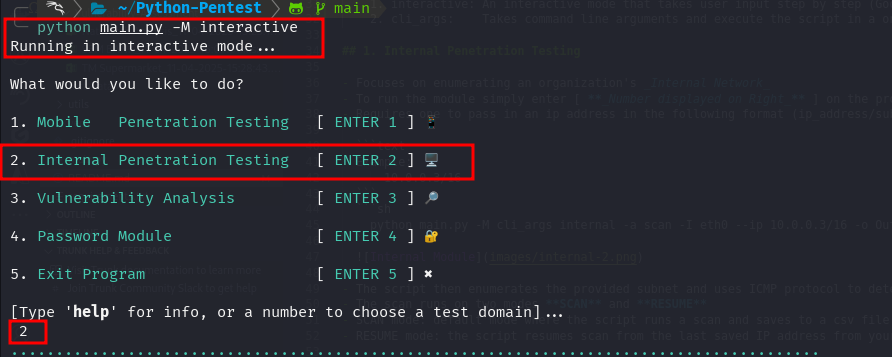
  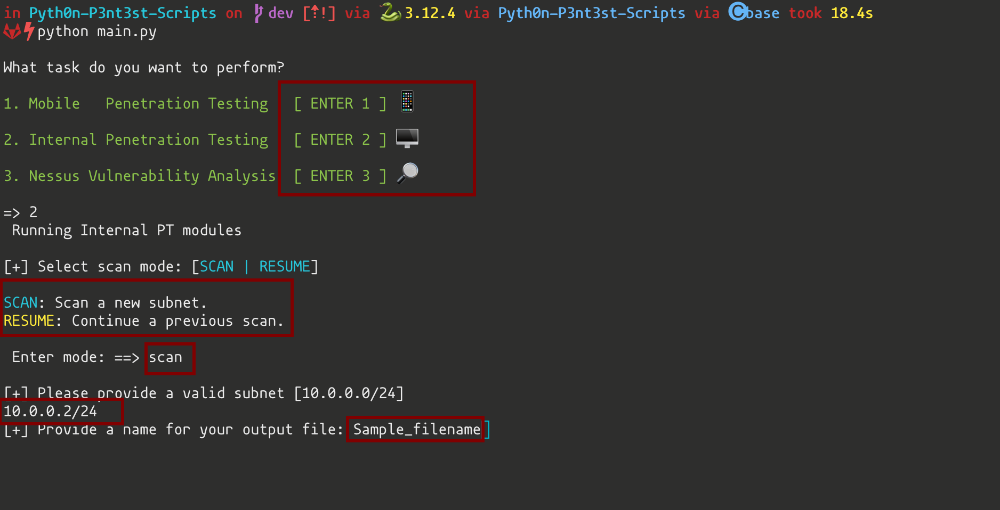
  
The script then enumerates the provided subnet and uses ICMP protocol to determine hosts that are alive on the network.
The scan runs on two modes **SCAN** and **RESUME**

**SCAN MODE**: default mode where the script runs a scan and saves to a csv file.
```sh
python main.py -M cli_args internal -a scan -I eth0 --ip 10.0.0.3/16 -o Output_file
```
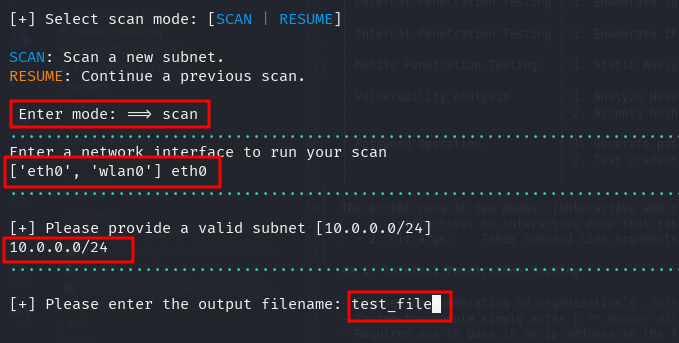

**RESUME MODE**: the script resumes scan from the last saved IP address from your provided csv file


Resume mode will however require you to select the filename that contains the unresponsive IP addresses.

It then sorts the IPs and selects the last IP in the file and resumes scan from there.

The script then looks for a file with a similar filename excluding "unresponsive" to update with newly found IPs.
The user is however required to provide the subnet that was being scanned initially i.e /8 /16 /24 e.t.c

```sh
    python main.py -M cli_args internal -a resume  -I eth0 --resume "/Path/to/unresponsive-file" --mask 16

```
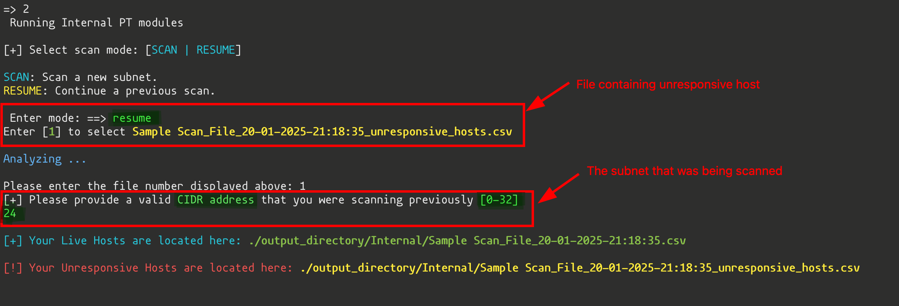
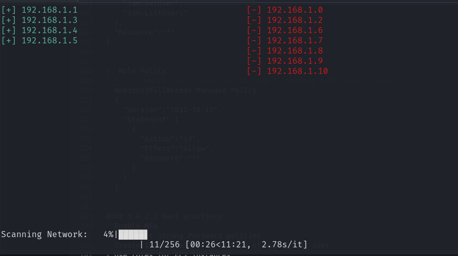

### Internal Resume Reliability Update (April 2026)

Changes carried out so far:

1. Baseline performance/behavior benchmarks were executed for both `scan` and `resume` on a `/16` subnet with a controlled timeout.
2. A new persistent session-state scaffold was added at `utils/internal/scan_session.py` to support:
   - scan session metadata persistence
   - atomic JSON state writes
   - throttled checkpoint updates (to avoid I/O bottlenecks)
   - interface similarity checks for safer resume behavior
3. Existing flow behavior was validated before integration so regressions can be measured against a known baseline.

#### Baseline commands used

```sh
# SCAN baseline (/16, 120s timeout, PTY for curses)
script -q -c "timeout -s INT 120 ./.venv/bin/python main.py -M cli_args internal -a scan -I wlan0 --ip 192.168.100.44/16 -o baseline_pre_scan.csv" /dev/null

# RESUME baseline (/16, 120s timeout, PTY for curses)
script -q -c "timeout -s INT 120 ./.venv/bin/python main.py -M cli_args internal -a resume -I wlan0 -r output_directory/Internal/baseline_pre_scan_27-04-2026-12:38:19_unresponsive_hosts.csv -m 16" /dev/null
```

#### Baseline results snapshot

- `scan` baseline: elapsed `121s`, partial progress `~15150/65536`, live hosts discovered `454`.
- `resume` baseline: elapsed `121s`, partial progress `~15075/50336`, live hosts discovered `342`.
- Both runs intentionally hit timeout and correctly retained unresponsive-host files for continuation.

#### Suggested pictorial evidence sections (add your screenshots)

You can add image evidence under this subsection using the following recommended captions:

1. Baseline scan command execution (CLI + startup banner)
2. Baseline scan progress view (`curses` screen)
3. Baseline scan timeout/interruption handling message
4. Baseline resume command execution (file + mask path)
5. Baseline resume progress view (`curses` screen)
6. Baseline resume timeout/interruption handling message
7. (After integration) automatic subnet recovery from saved session metadata
8. (After integration) interface similarity pass/fail behavior on resume

Recommended file names for these docs images:

- `images/docs/internal_baseline_scan_start.png`
- `images/docs/internal_baseline_scan_progress.png`
- `images/docs/internal_baseline_scan_timeout.png`
- `images/docs/internal_baseline_resume_start.png`
- `images/docs/internal_baseline_resume_progress.png`
- `images/docs/internal_baseline_resume_timeout.png`
- `images/docs/internal_resume_auto_subnet.png`
- `images/docs/internal_resume_interface_validation.png`

#### Image placeholders (drop screenshots into these paths)


_Baseline scan command execution (CLI + startup banner)_


_Baseline scan progress view (`curses` screen)_


_Baseline scan timeout/interruption handling message_


_Baseline resume command execution (file + mask path)_


_Baseline resume progress view (`curses` screen)_


_Baseline resume timeout/interruption handling message_


_(After integration) automatic subnet recovery from saved session metadata_


_(After integration) interface similarity pass/fail behavior on resume_

***

## 2. Vulnerability Analysis

This module runs an automated analysis on a **Nessus Advanced scan** and summarizes the vulnerabilities discovered.

To run the module simply enter [ **Number displayed on Right** ] on the provided prompt.

It requires 4 parameters in interactive mode:

```text
    Path to Scanned files: The Nessus scan results 
    Output file:           The Name of your analyzed file
    Scanner :              The scanner that was used to generate the 
    File Extension:        The extension of your files (csv|xslx|both)

```
In command line mode, the extensions are set as 'both' by default
```sh
python main.py -M cli_args va -s nessus -o OUTPUT -P "/Path/to/scanned/files" 
```
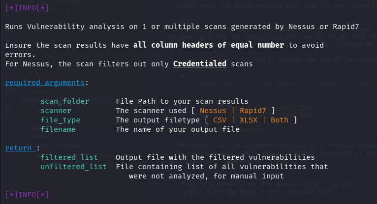
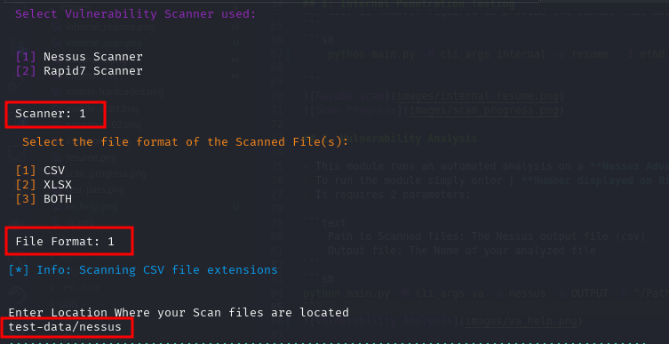
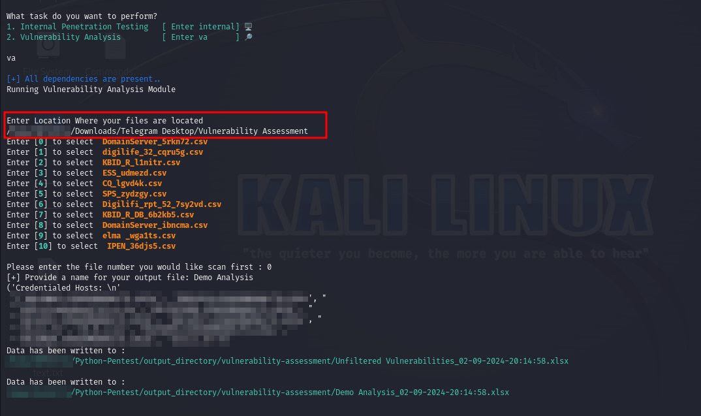

---

## 3. Mobile Penetration Testing


To run the module simply enter [ **Number displayed on Right** ] on the provided prompt.

This module performs a number of static analysis on both android and iOS 

It decompiles the apk file using apktool and runs regex checks on the files present on the decompiled application folder to look for
1. Hardcoded values
2. URLs present within the application
3. IP addresses present
4. Decode any available base64 strings

Mobile nuclei templates are automatically synced to the latest version before running nuclei checks.

Interactive mode:
- You provide a directory containing APK/IPA files.
- If multiple apps are found, you are prompted to choose `single` app scan or `all` apps scan.

CLI mode:
- `-P` accepts either a single APK/IPA file or a directory.
- If a directory is provided, the module scans all APK/IPA files in that directory by default.
- Use `--scan-mode single|all` to explicitly control directory behavior.
- Use `--taxonomy none|masvs|mastg|both` to generate optional MASVS/MASTG mapping output for static findings.
- Use `--taxonomy-profile strict|balanced|aggressive` to tune taxonomy mapping strictness.
- Runtime-only mobile artifacts (decompiled folders and template clones) are cleaned automatically after each run.

```sh
# Scan a single app file
python main.py -M cli_args mobile -P "/Path/To/Apk_or_iOS_file"

# Scan all APK/IPA files in a directory
python main.py -M cli_args mobile -P "/Path/To/Directory_With_Apps"

# Explicit directory scan mode
python main.py -M cli_args mobile -P "/Path/To/Directory_With_Apps" --scan-mode all

# Include MASVS + MASTG tags in static report artifacts
python main.py -M cli_args mobile -P "/Path/To/Directory_With_Apps" --scan-mode all --taxonomy both

# High-precision taxonomy mapping
python main.py -M cli_args mobile -P "/Path/To/Directory_With_Apps" --scan-mode all --taxonomy both --taxonomy-profile strict
```

### Start script

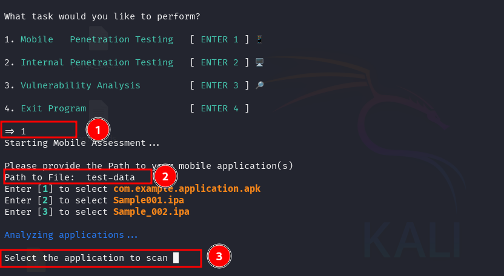

***

## 4. Password Operation Module

This module has two actions:

    generate ==> Generates a password list from your already cracked hashes and ntds file

    test ==> test your credentials against a particular IP address using SMB protocol (uses netexec)

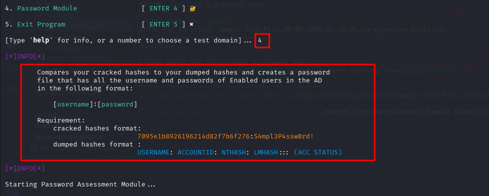

```sh
# Generate Password List
python main.py -M cli_args password -g --crack "/Path/to/cracked_hashes" --output my_password_list --dump "Path/to/dumps.ntds"

# Test Password
python main.py -M cli_args password -t --ip 10.0.0.3 --domain testdomain.co --pass_file my_password_list

```

### Required arguments

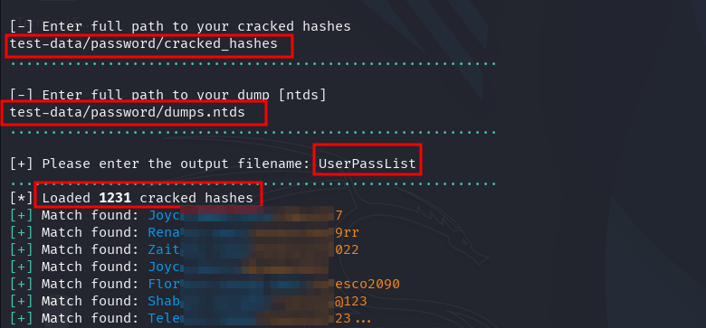

### Test Passwords

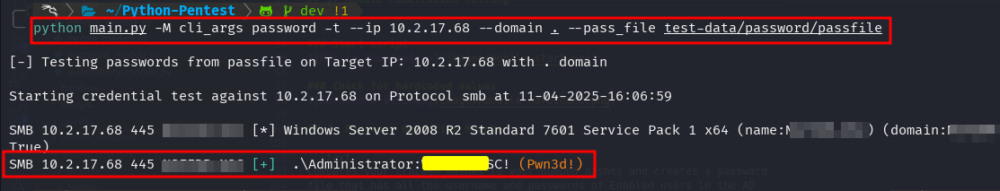

*** 

## 5. External Penetration Testing

Performs an end-to-end external assessment of a target domain by chaining seven
phases. Each phase produces its own artifacts inside
`output_directory/External/<domain>_<timestamp>/`, and a consolidated
`external_report.md` is written at the end of the run.

### Phases

| # | Phase        | Tools                                          | Output                                    |
|---|--------------|------------------------------------------------|-------------------------------------------|
| 1 | recon        | subfinder, assetfinder, amass, findomain, dnsx | `<domain>_subdomains.txt`, `resolved_*.txt` |
| 2 | probe        | httpx-toolkit                                  | `alive_hosts.json`, `alive_hosts.txt`     |
| 3 | ports        | nmap                                           | `nmap_results.txt`, `nmap_results.gnmap`  |
| 4 | screenshots  | gowitness                                      | `screenshots/*.png`                       |
| 5 | takeover     | subzy / subjack                                | `takeover_<tool>.txt`                     |
| 6 | urls         | gauplus / waybackurls                          | `historical_urls.txt`, `sensitive_urls.txt` |
| 7 | vulns        | nuclei                                         | `nuclei_results.txt`                      |

### Interactive mode

Pick the External option from the main menu, supply the target domain when
prompted, and either press Enter to run every phase or enter a comma-separated
subset (e.g. `recon,probe,vulns`).

### CLI mode

```sh
# Full run against example.com
python main.py -M cli_args external -d example.com

# Limit to a subset of phases
python main.py -M cli_args external -d example.com --phases recon,probe,vulns
```

### Notes

- Tools that aren't installed are skipped automatically; the consolidated
  report records each skipped phase along with the missing binary.
- AI summaries are appended to the report when `ANTHROPIC_API_KEY` is set
  (use `--no-ai` to disable globally).
- Temporary chaining artifacts used between external phases are cleaned automatically; only final phase outputs remain in the run directory.
