# Pyth0n-P3nt3st-Scripts

Python automation for common penetration-testing workflows:

- Internal network host discovery and resumable scans
- Vulnerability-analysis reporting for Nessus and Rapid7 exports
- Mobile static-analysis triage for APK/IPA files
- Password-list generation and credential testing
- External reconnaissance, probing, screenshots, takeover checks, URL collection, nuclei scans, and port scans

The framework supports two execution modes:

- `interactive`: guided prompts for first-time or manual operation
- `cli_args`: one-shot command-line execution for repeatable runs and automation

## Quick Start

```sh
python3 main.py
```

By default, the script starts in interactive mode. In non-interactive environments such as CI, cron, pipes, or redirected stdin, use `-M cli_args`.

```sh
python3 main.py -M cli_args <module> [options]
```

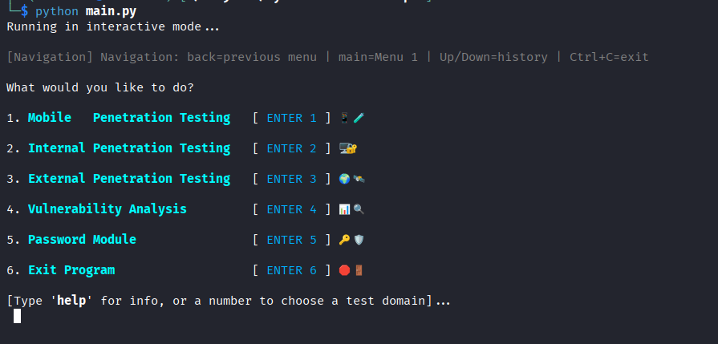

## First-Run Bootstrap

On first run, if `.venv` does not exist, the framework:

1. Creates `.venv`
2. Installs `requirements.txt`
3. Relaunches the script from the project virtual environment

Disable this behavior with:

```sh
export PENTEST_SKIP_VENV_BOOTSTRAP=1
```

## Security Gate

All commits and PRs must pass the project security gate.

Enable tracked hooks once per clone:

```sh
git config core.hooksPath .githooks
```

Run the gate manually:

```sh
./.venv/bin/python scripts/security_gate.py --staged
```

Commit messages must include:

```text
Security-Checklist: done
Security-Impact: <summary>
Security-Tests: <commands/results>
```

See [SECURITY.md](SECURITY.md) and [docs/commit_runbook.md](docs/commit_runbook.md) for the project security and commit-tracking workflow.

## Module Overview

| Module | Status | Summary |
|---|---:|---|
| `internal` | Complete | ICMP host discovery for CIDR ranges, resumable scan state, live/unresponsive CSV output |
| `va` | Complete | Nessus/Rapid7 CSV/XLSX ingestion, categorization, executive summary, multi-sheet XLSX reports |
| `mobile` | Complete | APK/IPA static triage, hardcoded value checks, URL/IP/base64 extraction, taxonomy tagging |
| `password` | Complete | Password list generation from cracked hashes and NTDS dumps; credential testing via NetExec |
| `external` | Complete | Recon, probing, screenshots, takeover checks, historical URLs, nuclei, and nmap phases |

## Internal Penetration Testing

The internal module enumerates hosts in a target CIDR and writes two CSV artifacts:

- live hosts
- unresponsive hosts for later resume

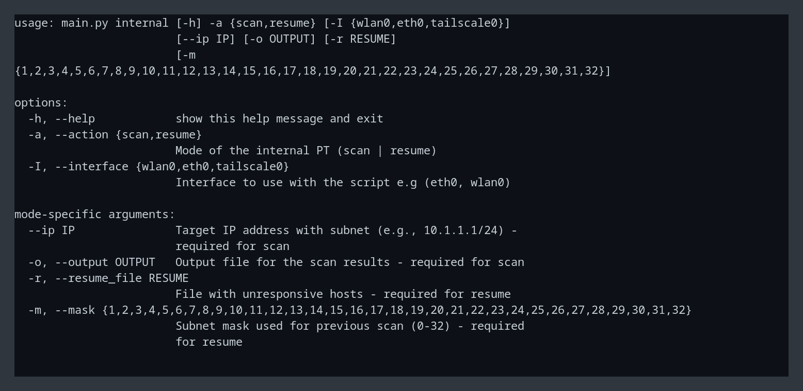

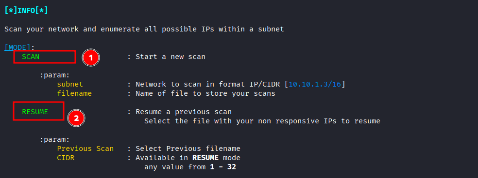

### Scan

```sh
python main.py -M cli_args internal \
  -a scan \
  -I eth0 \
  --ip 10.0.0.3/24 \
  -o internal_scan
```

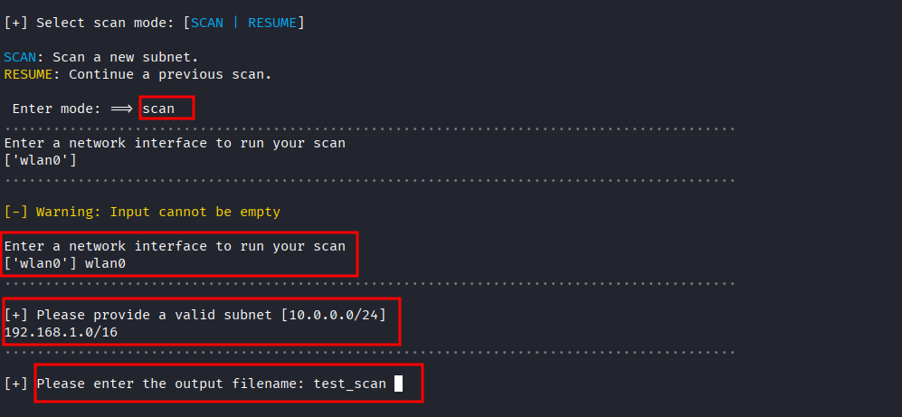

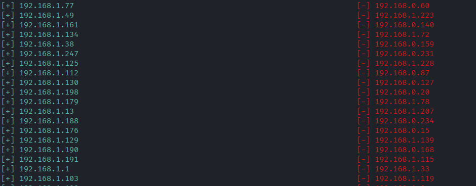

### Resume

```sh
python main.py -M cli_args internal \
  -a resume \
  -r output_directory/Internal/internal_scan_unresponsive_hosts.csv
```

Resume mode uses saved scan-session metadata to recover the subnet and matching active interface automatically, so normal CLI resume does not require `-I/--interface` or `-m/--mask`. Session metadata is stored under `output_directory/Internal/.scan_state/` to support safer continuation. Legacy unresponsive-host files without metadata can still be resumed by passing `-I/--interface` and `-m/--mask`.

## Vulnerability Analysis

The VA module analyzes Nessus and Rapid7 scan exports and writes a multi-sheet XLSX report.

Supported inputs:

- Nessus CSV/XLSX exports
- Rapid7 full CSV exports
- Rapid7 slimmer XLSX report exports

Current report behavior:

- Reads only required and scanner-specific optional columns for better large-file performance
- Preserves Nessus optional CVSS fields
- Normalizes Nessus `CVSS Vector` output from available vector variants
- Supports credentialed and uncredentialed Nessus processing
- Builds an executive summary sheet before detailed category sheets
- Produces category sheets such as RCE, missing patches, unsupported software, SSL/SSH/web issues, compliance, and unfiltered findings

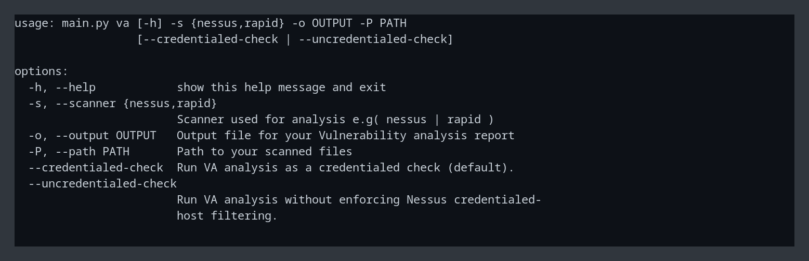

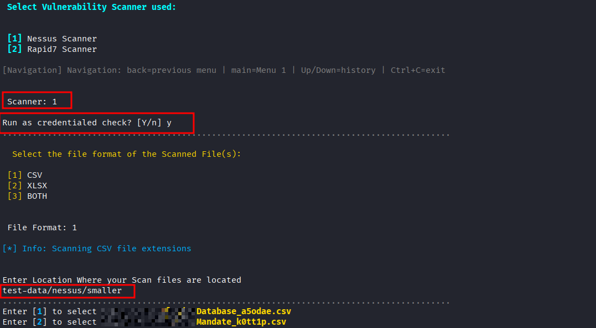

### Nessus

Credentialed checks are the default:

```sh
python main.py -M cli_args va \
  -s nessus \
  -o nessus_report \
  -P test-data/nessus
```

Analyze all scanned hosts without enforcing credentialed-host filtering:

```sh
python main.py -M cli_args va \
  -s nessus \
  -o nessus_uncredentialed_report \
  -P test-data/nessus \
  --uncredentialed-check
```

### Rapid7

```sh
python main.py -M cli_args va \
  -s rapid \
  -o rapid7_report \
  -P test-data/Rapid7
```

The Rapid7 path supports both the bundled `Vulnerability_Scan_Output.csv` and `Kingdom Bank Credentialed Scans for in-scope servers.xlsx` sample formats.

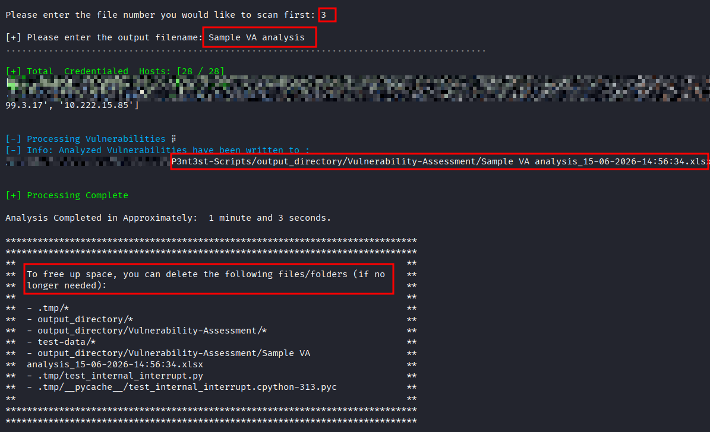

## Mobile Penetration Testing

The mobile module performs static analysis on APK/IPA files.

It can identify:

- hardcoded values
- URLs
- IP addresses
- base64 payloads
- obfuscated Android string-resource references
- optional MASVS/MASTG taxonomy mappings

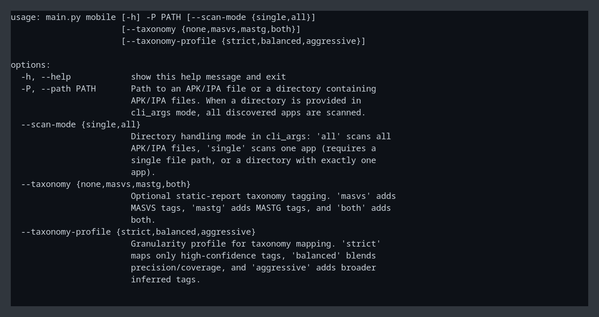

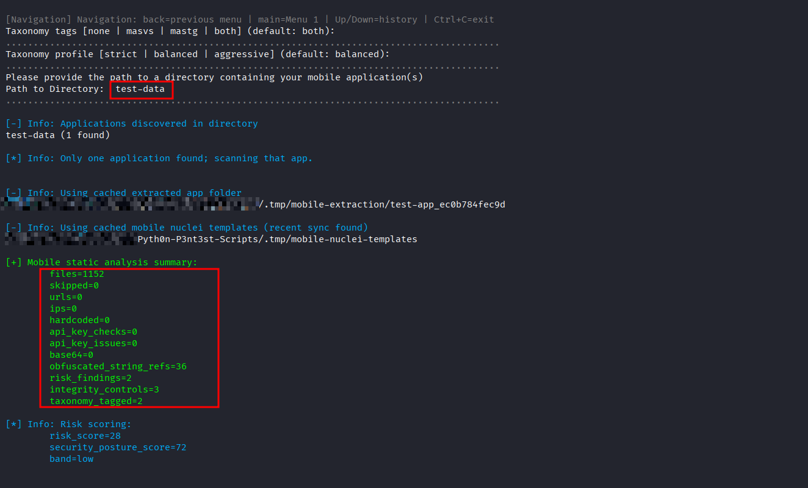

Scan one app:

```sh
python main.py -M cli_args mobile -P test-data/test-app.apk
```

Scan every app in a directory:

```sh
python main.py -M cli_args mobile \
  -P test-data \
  --scan-mode all \
  --taxonomy both \
  --taxonomy-profile balanced
```

Decompiled/extracted app folders are retained under `.tmp/mobile-extraction/` for manual review.

## Password Operations

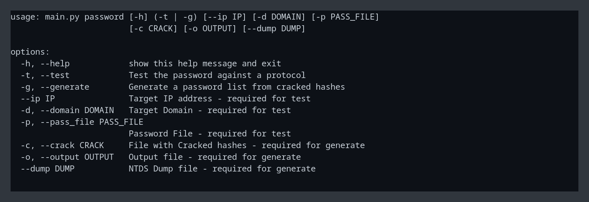

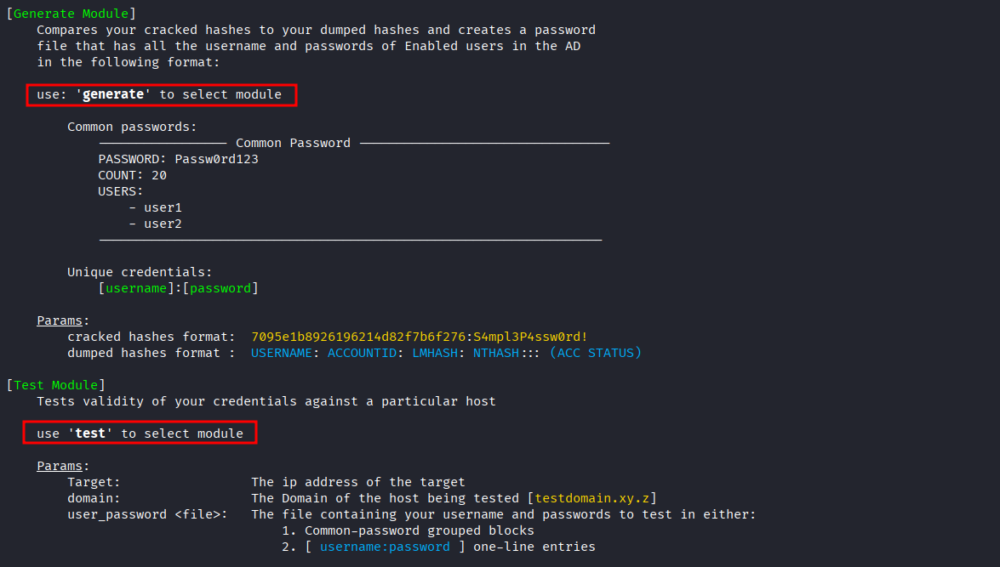

Generate a password list from cracked hashes and an NTDS dump:

```sh
python main.py -M cli_args password \
  -g \
  --crack test-data/password/cracked_hashes \
  --dump test-data/password/dumps.ntds \
  -o generated_passwords
```

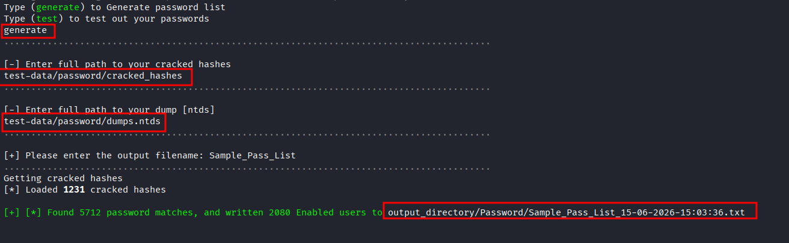

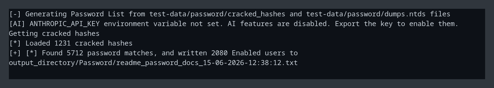

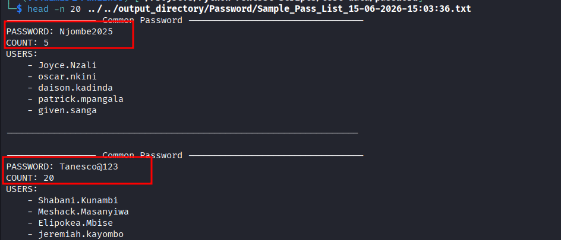

Test credentials against a target over SMB via NetExec:

```sh
python main.py -M cli_args password \
  -t \
  --ip 10.0.0.3 \
  --domain example.local \
  --pass_file output_directory/Password/generated_passwords.txt
```

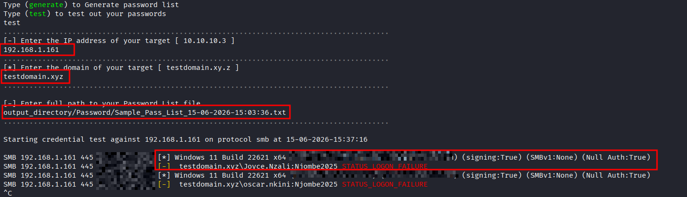

## External Penetration Testing

The external module chains these phases:

| # | Phase | Tools | Primary output |
|---:|---|---|---|
| 1 | `recon` | subfinder, assetfinder, amass, findomain, dnsx | subdomain and resolved-host lists |
| 2 | `probe` | httpx-toolkit | alive host JSON/TXT |
| 3 | `screenshots` | gowitness | web screenshots |
| 4 | `takeover` | subzy, subjack | takeover findings |
| 5 | `urls` | gauplus, waybackurls | historical and sensitive URL lists |
| 6 | `vulns` | nuclei | nuclei findings |
| 7 | `ports` | nmap | nmap output |

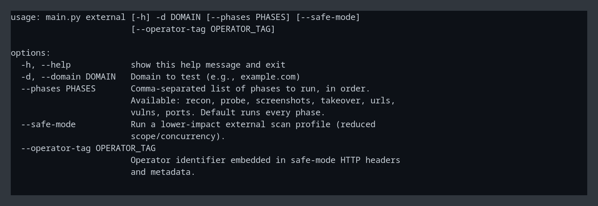

Run every phase:

```sh
python main.py -M cli_args external -d example.com
```

Run selected phases:

```sh
python main.py -M cli_args external \
  -d example.com \
  --phases recon,probe,vulns
```

Run lower-impact mode:

```sh
python main.py -M cli_args external \
  -d example.com \
  --safe-mode \
  --operator-tag analyst01
```

Missing tools are skipped and recorded in the consolidated external report.

## Sample Data

The `test-data/` folder contains inputs useful for smoke testing and screenshot generation:

- `test-data/test-nessus-VA.csv`
- `test-data/nessus/`
- `test-data/Rapid7/`
- `test-data/test-app.apk`
- `test-data/password/cracked_hashes`
- `test-data/password/dumps.ntds`

## Output Locations

Generated artifacts are written under `output_directory/`:

| Module | Directory |
|---|---|
| Internal | `output_directory/Internal/` |
| Vulnerability Analysis | `output_directory/Vulnerability-Assessment/` |
| Mobile | `output_directory/Mobile/` |
| Password | `output_directory/Password/` |
| External | `output_directory/External/` |

After CLI runs, the framework prints recently created output paths and cleanup candidates.
