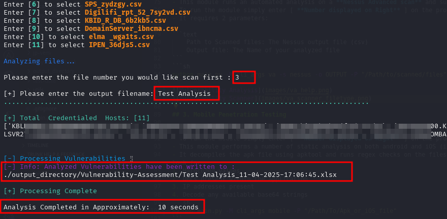

# Pyth0n-P3nt3st-Scripts

Python scripts to aid in pentest automation.
- Start by installing all the dependencies in the requirements.txt

| Domain                       | Script Target                     |
|------------------------------|-----------------------------------|
| External Penetration Testing | 1. Enumerate subdomains           |
|                              |                                   |
| Internal Penetration Testing | 1. Enumerate IPs give CIDR        |
|                              | 2. Run netexec                    |
|                              | 3. Compare Hashes obtained        |
|                              |                                   |
| Mobile Penetration Testing   | 1. Static Analysis [iOS/Android]  |
|                              |                                   |
| Vulnerability Analysis       | 1. Analyze Nessus VA output (csv) |

## 1. Internal Penetration Testing

- Focuses on enumerating an organization's _Internal Network_
- To run the module simply enter [ **_Number displayed on Right_** ] on the provided prompt
- Requires one to pass in an ip address in the following format (ip_address/subnet)
 
  ```text
  Example:
      10.0.0.3/16
  ```
  

- The script then enumerates the provided subnet and uses ICMP protocol to determine hosts that are alive on the network
- The scan runs on two modes **SCAN** and **RESUME**
- SCAN mode: default mode where the script runs a scan and saves to a csv file
- RESUME mode: the script resumes scan from the last saved IP address from your provided csv file

```text
Resume mode will however require you to select the filename that contains the unresponsive IP addresses
It then sorts the IPs and selects the last IP in the file and resumes scan from there.

The user is however required to provide the subnet that was being scanned initially i.e /8 /16 /24 e.t.c


```


## 2. Vulnerability Analysis

- This module runs an automated analysis on a **Nessus Advanced scan** and summarizes the vulnerabilities discovered
- To run the module simply enter [ **Number displayed on Right** ] on the provided prompt
- It requires 2 parameters:

```text
    Path to Scanned files: The Nessus output file (csv)
    Output file: The Name of your analyzed file
```


## 3. Mobile Penetration Testing


- To run the module simply enter [ **Number displayed on Right** ] on the provided prompt
- This module performs a number of static analysis on both android and iOS (iOS coming soon)
- It decompiles the apk file using apktool and runs regex checks on the files present on the decompiled application folder to look for
1. Hardcoded values
2. URLs present within the application
3. IP addresses present
4. Decode any available base64 strings

### Start script


### Check for hardcoded values


## 4. External Penetration Testing

[Coming Soon]

- To run the module simply enter [ **Number displayed on Right** ] on the provided prompt


