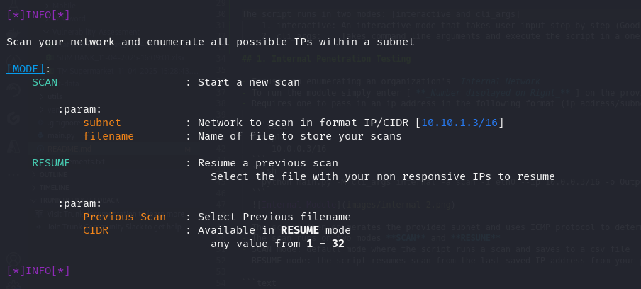
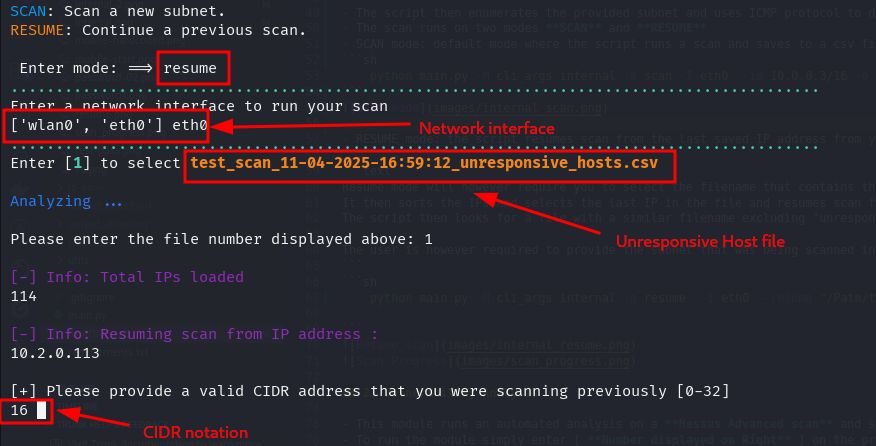
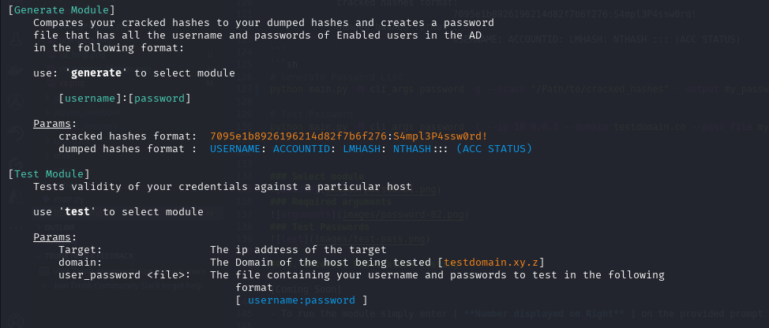

# Pyth0n-P3nt3st-Scripts

Python scripts that aims to automate common activities conducted during penetration testing.
- Start by creating a virtual environment and installing all the dependencies in the requirements.txt
```shell
python3 -m venv <virtual_env_name>
source <virtual_env_name>/bin/activate

pip3 install -r requirements.txt

```
  
Some of the Scope covered or in progress include but not limited to:

| Domain                       | Script Target                                                      |
|------------------------------|--------------------------------------------------------------------|
| External Penetration Testing | 1. Enumerate subdomains                           [coming_soon]    |
|                              |                                                                    |
| Internal Penetration Testing | 1. Enumerate IPs give CIDR                        [completed]      |
|                              |                                                                    |
| Mobile Penetration Testing   | 1. Static Analysis (iOS/Android)                  [completed]      |
|                              |                                                                    |
| Vulnerability Analysis       | 1. Analyze Nessus and Rapid7 VA scans             [completed]      |
|                              | 2. Accepts both CSV and XSLX inputs               [completed]      |
|                              |                                                                    |
| Password Operation           | 1. Generate password list from cracked hashes     [completed]      |
|                              | 2. Test credentials                               [completed]      |
|                              |                                                                    |

The script runs in two modes: [interactive and cli_args]
- 1. interactive: An interactive mode that takes user input step by step (Good for first time run)
- 2. cli_args:    Takes command line arguments and execute the script in a one liner

## 1. Internal Penetration Testing

- Focuses on enumerating an organization's _Internal Network_
- To run the module simply enter [ **_Number displayed on Right_** ] on the provided prompt
- Requires one to pass in an ip address in the following format (ip_address/subnet)

  
  
  
- The script then enumerates the provided subnet and uses ICMP protocol to determine hosts that are alive on the network
- The scan runs on two modes **SCAN** and **RESUME**
- SCAN mode: default mode where the script runs a scan and saves to a csv file
```sh
    python main.py -M cli_args internal -a scan -I eth0 --ip 10.0.0.3/16 -o Output_file
```


- RESUME mode: the script resumes scan from the last saved IP address from your provided csv file

```text
Resume mode will however require you to select the filename that contains the unresponsive IP addresses
It then sorts the IPs and selects the last IP in the file and resumes scan from there.
The script then looks for a file with a similar filename excluding "unresponsive" to update

The user is however required to provide the subnet that was being scanned initially i.e /8 /16 /24 e.t.c
```
```sh
    python main.py -M cli_args internal -a resume  -I eth0 --resume "/Path/to/unresponsive-file" --mask 16

```



## 2. Vulnerability Analysis

- This module runs an automated analysis on a **Nessus Advanced scan** and summarizes the vulnerabilities discovered
- To run the module simply enter [ **Number displayed on Right** ] on the provided prompt
- It requires 2 parameters:

```text
    Path to Scanned files: The Nessus output file (csv)
    Output file: The Name of your analyzed file
```
```sh
python main.py -M cli_args va -s nessus -o OUTPUT -P "/Path/to/scanned/files" 
```


## 3. Mobile Penetration Testing


- To run the module simply enter [ **Number displayed on Right** ] on the provided prompt
- This module performs a number of static analysis on both android and iOS (iOS coming soon)
- It decompiles the apk file using apktool and runs regex checks on the files present on the decompiled application folder to look for
1. Hardcoded values
2. URLs present within the application
3. IP addresses present
4. Decode any available base64 strings
```sh
python main.py -M cli_args mobile -P "/Path/To/Apk_or_iOS_file"
```

### Start script


### Check for hardcoded values


## 4. Password Operation Module
This module has two actions:
    generate ==> Generates a password list from your already cracked hashes and ntds file
    test ==> test your credentials against a particular IP address using SMB protocol (uses netexec)



```sh
# Generate Password List
python main.py -M cli_args password -g --crack "/Path/to/cracked_hashes" --output my_password_list --dump "Path/to/dumps.ntds"

# Test Password
python main.py -M cli_args password -t --ip 10.0.0.3 --domain testdomain.co --pass_file my_password_list

```

### Select module

### Required arguments

### Test Passwords


## 5. External Penetration Testing

[Coming Soon]

- To run the module simply enter [ **Number displayed on Right** ] on the provided prompt


